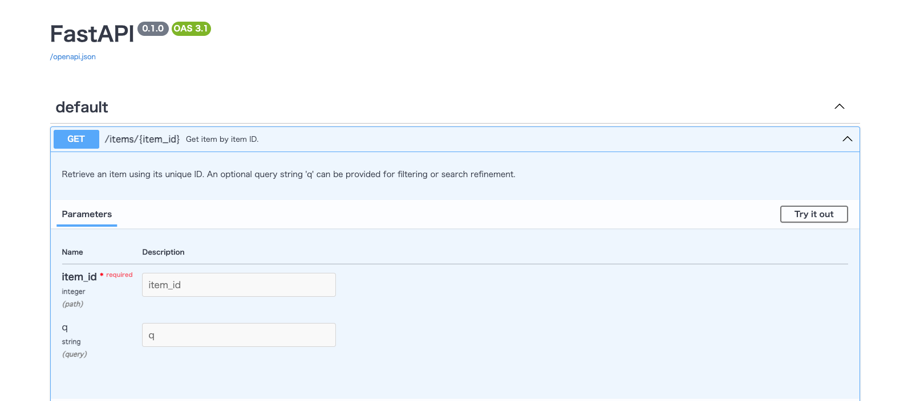
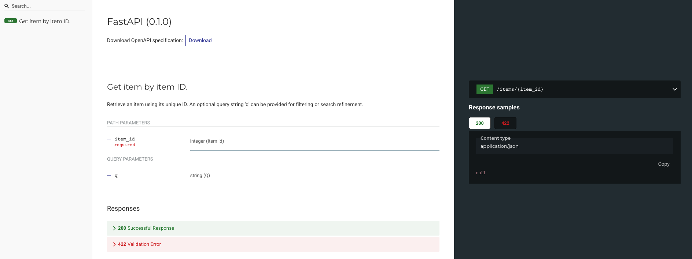

# APIドキュメントの自動生成

---

## APIドキュメントとは

* **APIドキュメント**とは、作成したWeb APIの「仕様書」です。
* どんなAPIがあるか、どんなデータを送ればよいか、どんなレスポンスが返るかを記載します。
* FastAPIでは、コードを書くと**自動でAPIドキュメントが作成**されます。

---

## APIドキュメントの確認方法

FastAPIアプリを起動すると、以下の2つのURLが使えます：

| URL                           | 内容                      |
| ----------------------------- | ----------------------- |
| `http://localhost:8000/docs`  | Swagger UI（インタラクティブなUI） |
| `http://localhost:8000/redoc` | ReDoc（見やすい読み物形式）        |

---
### API実装例
```python  
from fastapi import FastAPI

app = FastAPI()


@app.get("/items/{item_id}", summary="Get item by item ID.")
def read_item(item_id: int, q: str = None):
    """
    Retrieve an item using its unique ID.
    An optional query string 'q' can be provided for filtering or search refinement.
    """
    return {"item_id": item_id, "q": q}
```  


### Swagger UI の画面（例）

* APIの一覧が表示される
* 「Try it out」ボタンで実際にAPIを試せる
* パラメータの説明やレスポンス例も表示


### Redoc の画面（例）




---

### ✅ 自動ドキュメントのポイント

* 関数のアノテーション（型情報）から自動生成
* `BaseModel` で定義したリクエスト/レスポンスモデルも反映
* 開発者も利用者も**手間なく仕様を確認できる**
