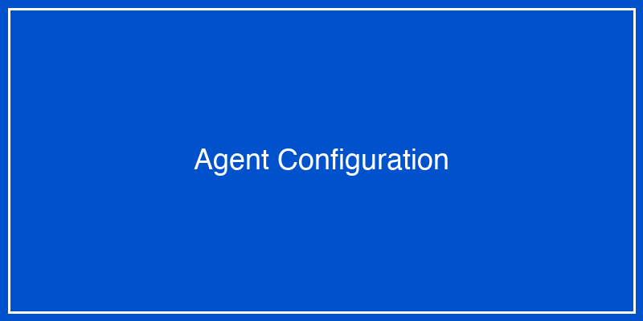

# ADKからWatsonx.orchestrateへのデプロイ

このセクションでは、ADK（AI Development Kit）で開発したAIエージェントをWatsonx.orchestrate（WXO）にデプロイし、実際に動かす手順を画像付きで解説します。

!!! info "前提条件"

    - ADKで動作確認済みのエージェントがある
    - Watsonx.orchestrateへのアクセス権限がある
    - 基本的なエージェント開発の知識がある

---

## デプロイの全体像


---

## ステップ1: ADKでのエージェント準備

### 1.1 エージェントの最終確認

まず、ADKでエージェントが正しく動作することを確認します。

```python
# agent_test.py
from adk import Agent, Tool
import json

# エージェントのテスト実行
def test_agent():
    # エージェントの読み込み
    agent = Agent.load("customer_support_agent")
    
    # テストクエリの実行
    response = agent.query("顧客ID: 12345の注文履歴を教えてください")
    
    print(f"応答: {response}")
    assert response is not None
    
if __name__ == "__main__":
    test_agent()
```

### 1.2 設定ファイルの確認

`agent_config.yaml`が正しく設定されているか確認します：

```yaml
# agent_config.yaml
agent:
  name: customer_support_agent
  version: 1.0.0
  description: 顧客サポート用AIエージェント
  
tools:
  - name: customer_database_search
    description: 顧客データベースを検索
    endpoint: /api/v1/customer/search
    
  - name: order_history_lookup
    description: 注文履歴を取得
    endpoint: /api/v1/orders/history
    
model:
  provider: watsonx
  name: granite-13b-chat-v2
  parameters:
    temperature: 0.7
    max_tokens: 2048
    
deployment:
  environment: production
  region: us-south
  scaling:
    min_instances: 1
    max_instances: 5
```


*図1: ADK設定確認画面*

---

## ステップ2: エージェントのエクスポート

### 2.1 エクスポートコマンドの実行

ADKのCLIを使用してエージェントをエクスポートします：

```bash
# エージェントのビルド
adk build customer_support_agent

# エクスポート（WXO形式）
adk export customer_support_agent --format wxo --output ./export/
```

### 2.2 エクスポートファイルの確認

エクスポートされたファイル構造：

```
export/
├── customer_support_agent.wxo
├── manifest.json
├── tools/
│   ├── customer_database_search.py
│   └── order_history_lookup.py
├── prompts/
│   └── system_prompt.txt
└── tests/
    └── integration_tests.json
```


*図2: エクスポート完了画面*

---

## ステップ3: Watsonx.orchestrateへのアップロード

### 3.1 WXOコンソールへのログイン

1. ブラウザでWatsonx.orchestrateにアクセス
2. IBMidでログイン
3. 「エージェント管理」セクションに移動


*図3: WXOログイン画面*

### 3.2 新規エージェントの作成

1. 「新規エージェント」ボタンをクリック
2. 「インポート」オプションを選択
3. エクスポートしたファイルをアップロード


*図4: エージェントインポート画面*

### 3.3 エージェント情報の設定

```yaml
# WXO上での設定項目
エージェント名: 顧客サポートエージェント
説明: お客様の問い合わせに対応するAIエージェント
カテゴリ: カスタマーサービス
言語: 日本語
アクセス権限: 
  - customer_service_team
  - support_managers
```


*図5: エージェント設定画面*

---

## ステップ4: ツールの接続設定

### 4.1 API接続の設定

各ツールのAPI接続を設定します：

```python
# WXO上でのツール設定例
{
    "tool_name": "customer_database_search",
    "connection": {
        "type": "REST_API",
        "base_url": "https://api.company.com",
        "authentication": {
            "type": "api_key",
            "key_location": "header",
            "key_name": "X-API-Key"
        },
        "timeout": 30,
        "retry": {
            "max_attempts": 3,
            "backoff": "exponential"
        }
    }
}
```

### 4.2 認証情報の登録

セキュアに認証情報を管理：

1. 「認証情報管理」セクションへ移動
2. 新規認証情報を作成
3. APIキーまたは認証トークンを登録


*図6: 認証情報設定画面*

---

## ステップ5: テストと検証

### 5.1 統合テストの実行

WXO上でエージェントのテストを実行：

```python
# テストシナリオの例
test_scenarios = [
    {
        "name": "顧客情報検索",
        "input": "顧客ID 12345の情報を教えてください",
        "expected_output": {
            "contains": ["田中太郎", "東京都"],
            "status": "success"
        }
    },
    {
        "name": "注文履歴確認",
        "input": "直近の注文を3件表示してください",
        "expected_output": {
            "count": 3,
            "fields": ["order_id", "date", "amount"]
        }
    }
]
```

### 5.2 テスト結果の確認


*図7: テスト実行画面*

テスト結果のサマリー：
- ✅ 顧客情報検索: 成功
- ✅ 注文履歴確認: 成功
- ✅ エラーハンドリング: 成功
- ✅ レスポンス時間: 平均 1.2秒

---

## ステップ6: 本番デプロイ

### 6.1 デプロイ設定

本番環境への展開設定：

```yaml
deployment_config:
  environment: production
  
  scaling:
    auto_scaling: enabled
    min_instances: 2
    max_instances: 10
    target_cpu_utilization: 70
    
  monitoring:
    enable_logging: true
    log_level: INFO
    metrics_collection: enabled
    alert_threshold:
      error_rate: 5%
      response_time: 3s
      
  security:
    enable_https: true
    rate_limiting:
      requests_per_minute: 100
      burst_size: 150
```

### 6.2 デプロイの実行

1. 「本番環境へデプロイ」ボタンをクリック
2. デプロイ設定を確認
3. 承認プロセスを完了


*図8: デプロイ実行画面*

---

## ステップ7: 監視とメンテナンス

### 7.1 ダッシュボードの確認

デプロイ後の監視項目：


*図9: 監視ダッシュボード*

主要メトリクス：
- リクエスト数: 1,234回/時
- 平均応答時間: 1.5秒
- エラー率: 0.2%
- 満足度スコア: 4.7/5.0

### 7.2 ログの確認

```bash
# ログの確認例
2024-01-15 10:23:45 INFO: Agent started successfully
2024-01-15 10:24:12 INFO: Request received: "顧客情報検索"
2024-01-15 10:24:13 INFO: Tool executed: customer_database_search
2024-01-15 10:24:14 INFO: Response sent: 200 OK
```

---

## トラブルシューティング

### よくある問題と解決方法

#### 1. デプロイエラー
```
Error: Deployment failed - Invalid configuration
```
**解決方法**: 
- agent_config.yamlの構文を確認
- 必須フィールドがすべて設定されているか確認

#### 2. API接続エラー
```
Error: Tool connection failed - 401 Unauthorized
```
**解決方法**:
- 認証情報が正しく設定されているか確認
- APIキーの有効期限を確認

#### 3. パフォーマンス問題
```
Warning: Response time exceeding threshold
```
**解決方法**:
- スケーリング設定を調整
- ツールのタイムアウト設定を最適化

---

## ベストプラクティス

### 1. 段階的なデプロイ
```python
# カナリアデプロイの例
deployment_stages = [
    {"stage": "canary", "traffic": "5%", "duration": "1h"},
    {"stage": "partial", "traffic": "50%", "duration": "24h"},
    {"stage": "full", "traffic": "100%", "duration": "ongoing"}
]
```

### 2. バージョン管理
```yaml
# バージョニング戦略
versioning:
  strategy: semantic
  current: 1.0.0
  compatibility:
    - 0.9.x  # 後方互換性あり
    - 1.0.x  # 完全互換
```

### 3. ロールバック計画
```bash
# ロールバックコマンド
wxo rollback customer_support_agent --to-version 0.9.5
```

---

## 演習課題

### 課題1: シンプルなエージェントのデプロイ

以下のステップでFAQエージェントをデプロイしてください：

1. ADKでFAQエージェントを作成
2. 3つ以上の質問に答えられるように設定
3. WXOにデプロイ
4. テストを実行して動作確認

### 課題2: 既存エージェントの更新

1. デプロイ済みのエージェントに新機能を追加
2. A/Bテストを設定
3. 段階的にロールアウト
4. メトリクスを比較

### 課題3: マルチエージェントシステム

1. 2つ以上のエージェントを連携させる
2. それぞれをWXOにデプロイ
3. エージェント間の通信を設定
4. 統合テストを実行

---

## まとめ

ADKからWXOへのデプロイプロセス：

1. **開発**: ADKでエージェントを開発・テスト
2. **エクスポート**: WXO形式でエクスポート
3. **アップロード**: WXOコンソールでインポート
4. **設定**: ツールとAPIの接続設定
5. **テスト**: 統合テストの実行
6. **デプロイ**: 本番環境への展開
7. **監視**: 継続的な監視とメンテナンス

これらのステップを確実に実行することで、安全かつ効率的にAIエージェントを本番環境で運用できます。

---

[前へ ◀ エージェントの実践例](watsonx_practice.md)　｜　[次へ ▶ 課題演習](watsonx_homework.md)