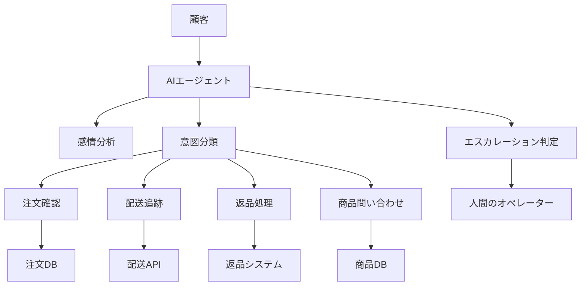

# Watsonx 課題演習

このセクションでは、実務で活用できるAIエージェントを自分で設計・開発する課題を提供します。各課題は段階的に難易度が上がるように設計されています。

!!! info "課題の進め方"

    1. 各課題の要件を理解する
    2. 設計を行う（エージェントの役割、必要なツール、プロンプト）
    3. ADKで実装する
    4. テストを行う
    5. （オプション）WXOにデプロイする

---

## 課題1: 社内IT問い合わせ対応エージェント 【難易度：★☆☆】

### 背景
社内のIT部門には、パスワードリセットやソフトウェアのインストール方法など、同じような問い合わせが繰り返し来ます。これらの基本的な問い合わせに自動対応するエージェントを作成してください。

### 要件
1. **対応する問い合わせ種別**
   - パスワードリセット手順の案内
   - VPN接続方法の説明
   - プリンター設定のガイド
   - よく使うソフトウェアのインストール手順

2. **機能要件**
   - ユーザーの問い合わせ内容を理解し、適切なカテゴリに分類
   - 段階的な手順を分かりやすく説明
   - 必要に応じて画像やリンクを提示
   - 解決できない場合は人間のサポートにエスカレーション

### 実装のヒント

```yaml
# agent_config.yaml の例
agent:
  name: it_support_agent
  description: 社内IT問い合わせ対応エージェント
  
  system_prompt: |
    あなたは社内ITサポートの専門家です。
    ユーザーからの技術的な問い合わせに対して、
    親切で分かりやすい説明を心がけてください。
    
    対応可能な問い合わせ：
    1. パスワード関連
    2. VPN接続
    3. プリンター設定
    4. ソフトウェアインストール
    
    解決できない場合は、ITヘルプデスク（内線: 1234）への
    連絡を案内してください。

tools:
  - name: knowledge_search
    description: IT手順書データベースを検索
  - name: ticket_creation
    description: サポートチケットを作成
```

### 評価基準
- [ ] 4種類以上の問い合わせに適切に対応できる
- [ ] 手順が明確で分かりやすい
- [ ] エスカレーションが適切に機能する
- [ ] ユーザビリティが高い（親切な対応）

---

## 課題2: 在庫管理アシスタント 【難易度：★★☆】

### 背景
倉庫の在庫管理を効率化するため、在庫の確認、発注提案、在庫レポート作成を行うエージェントを開発してください。

### 要件
1. **基本機能**
   - 商品名やSKUから在庫数を検索
   - 在庫切れ・在庫僅少の商品をアラート
   - 過去の出荷データから適正在庫を計算
   - 発注提案の作成

2. **レポート機能**
   - 日次在庫レポートの生成
   - ABC分析（商品の重要度分析）
   - 在庫回転率の計算

3. **データ連携**
   - 在庫データベースとの連携
   - 発注システムとの連携
   - Excelレポートの出力

### 実装例

```python
# tools/inventory_tools.py
from typing import Dict, List
import pandas as pd

class InventoryTools:
    def check_stock(self, product_id: str) -> Dict:
        """
        在庫数を確認
        """
        # 実装例
        return {
            "product_id": product_id,
            "product_name": "製品A",
            "current_stock": 150,
            "reserved": 20,
            "available": 130,
            "reorder_point": 100,
            "status": "normal"
        }
    
    def calculate_reorder_quantity(self, product_id: str) -> Dict:
        """
        適正発注量を計算
        """
        # 過去の販売データから計算
        daily_average = 10
        lead_time = 7
        safety_stock = 50
        
        reorder_qty = (daily_average * lead_time) + safety_stock
        
        return {
            "product_id": product_id,
            "recommended_quantity": reorder_qty,
            "estimated_cost": reorder_qty * 1000
        }
    
    def generate_inventory_report(self) -> str:
        """
        在庫レポートを生成
        """
        # レポート生成ロジック
        report = """
        📊 日次在庫レポート
        日付: 2024-01-15
        
        【在庫サマリー】
        - 総SKU数: 500
        - 在庫切れ: 5件
        - 在庫僅少: 23件
        - 過剰在庫: 12件
        
        【要対応商品】
        1. 商品A (SKU: 12345) - 在庫切れ
        2. 商品B (SKU: 23456) - 残り10個
        ...
        """
        return report
```

### プロンプト設計

```python
system_prompt = """
あなたは在庫管理の専門家です。以下の役割を担います：

1. 在庫状況の確認と報告
2. 適正在庫の維持に向けた提案
3. 発注タイミングと数量の最適化
4. 在庫関連の問題解決

重要な指標：
- 在庫回転率
- 欠品率
- 過剰在庫率
- リードタイム

常に数値に基づいた客観的な分析を行い、
コスト削減と顧客満足度の両立を目指してください。
"""
```

### 評価基準
- [ ] 在庫検索が正確に動作する
- [ ] 発注提案が適切（過不足がない）
- [ ] レポートが見やすく実用的
- [ ] エラーハンドリングが適切
- [ ] COBOLシステムとの連携を想定した設計

---

## 課題3: 顧客対応自動化エージェント 【難易度：★★★】

### 背景
ECサイトの顧客サポートを自動化するエージェントを開発します。注文確認、配送状況、返品対応など、幅広い問い合わせに対応する必要があります。

### 要件

1. **顧客対応機能**
   - 注文状況の確認
   - 配送追跡
   - 返品・交換の受付
   - 商品に関する質問への回答
   - クレーム対応（一次対応）

2. **システム連携**
   - 注文管理システム
   - 配送業者API
   - 商品データベース
   - CRMシステム

3. **高度な機能**
   - 感情分析による適切な対応
   - 多言語対応（日本語・英語）
   - 優先度判定とエスカレーション
   - 対応履歴の記録と分析

### アーキテクチャ設計



### 実装の重要ポイント

```python
# エージェントの感情対応
class EmotionalResponseHandler:
    def analyze_emotion(self, text: str) -> str:
        """
        顧客の感情を分析
        """
        # 実装例
        keywords = {
            "anger": ["怒", "最悪", "ひどい", "許せない"],
            "frustration": ["困った", "わからない", "できない"],
            "satisfaction": ["ありがとう", "助かった", "素晴らしい"]
        }
        
        # 感情スコアを計算
        emotion_scores = self.calculate_emotion_scores(text, keywords)
        return max(emotion_scores, key=emotion_scores.get)
    
    def generate_response(self, emotion: str, content: str) -> str:
        """
        感情に応じた応答を生成
        """
        templates = {
            "anger": "大変申し訳ございません。お客様のお気持ち、重く受け止めております。{content}",
            "frustration": "お困りのこと、承知いたしました。{content}",
            "satisfaction": "お役に立てて嬉しいです。{content}"
        }
        
        return templates.get(emotion, "{content}").format(content=content)
```

### マルチエージェント構成

```yaml
# 専門エージェントの定義
agents:
  - name: order_specialist
    role: 注文関連の問い合わせ専門
    skills:
      - 注文検索
      - 注文変更
      - キャンセル処理
      
  - name: shipping_specialist
    role: 配送関連の問い合わせ専門
    skills:
      - 配送状況確認
      - 配送日時変更
      - 配送業者連携
      
  - name: product_specialist
    role: 商品関連の問い合わせ専門
    skills:
      - 商品仕様説明
      - 在庫確認
      - 類似商品提案
      
  - name: complaint_handler
    role: クレーム対応専門
    skills:
      - 感情分析
      - 問題解決提案
      - エスカレーション判定
```

### 評価基準
- [ ] 5種類以上の問い合わせタイプに対応
- [ ] 感情に応じた適切な対応
- [ ] システム連携が正しく機能
- [ ] エスカレーションの判断が適切
- [ ] 対応品質が一定以上（顧客満足度）

---

## 課題4: 統合業務支援エージェント 【難易度：★★★★】

### 背景
COBOLで構築された基幹システムと連携し、複数の業務プロセスを横断的に支援する統合エージェントを開発します。

### 要件

1. **対応業務範囲**
   - 受注処理
   - 在庫管理
   - 請求処理
   - 売上分析
   - 予算管理

2. **COBOL連携**
   - バッチジョブの実行監視
   - データ変換（EBCDIC ↔ UTF-8）
   - トランザクション管理
   - エラーリカバリー

3. **高度な分析機能**
   - 売上予測
   - 異常検知
   - 最適化提案
   - What-if分析

### 実装チャレンジ

```python
# COBOL連携アダプター
class COBOLAdapter:
    def __init__(self):
        self.encoding = 'cp939'  # EBCDIC Japanese
        
    def call_cobol_program(self, program_name: str, params: dict) -> dict:
        """
        COBOLプログラムを呼び出し
        """
        # パラメータをCOBOL形式に変換
        cobol_params = self.convert_to_cobol_format(params)
        
        # JCL生成
        jcl = self.generate_jcl(program_name, cobol_params)
        
        # ジョブ実行
        job_id = self.submit_job(jcl)
        
        # 結果待機
        result = self.wait_for_job(job_id)
        
        # 結果をPython形式に変換
        return self.convert_from_cobol_format(result)
    
    def convert_to_cobol_format(self, data: dict) -> bytes:
        """
        PythonデータをCOBOLレイアウトに変換
        """
        # 固定長レコードの生成
        record = ""
        for field, value in data.items():
            if isinstance(value, str):
                # 文字フィールド（右側空白埋め）
                record += value.ljust(self.field_lengths[field])
            elif isinstance(value, int):
                # 数値フィールド（左側ゼロ埋め）
                record += str(value).zfill(self.field_lengths[field])
                
        return record.encode(self.encoding)
```

### 統合ワークフロー

```yaml
# 月次決算支援ワークフロー
workflow:
  name: monthly_closing_assistant
  
  steps:
    - name: データ収集
      agents:
        - sales_data_collector
        - inventory_checker
        - ar_ap_collector
      
    - name: データ検証
      agents:
        - data_validator
        - anomaly_detector
      
    - name: 集計処理
      agents:
        - aggregation_processor
        - cobol_batch_runner
      
    - name: レポート生成
      agents:
        - report_generator
        - visualization_creator
      
    - name: 承認フロー
      agents:
        - approval_coordinator
        - notification_sender
```

### 評価基準
- [ ] 5つ以上の業務プロセスに対応
- [ ] COBOL連携が安定して動作
- [ ] エラー処理とリカバリーが適切
- [ ] パフォーマンスが実用レベル
- [ ] 監査証跡が適切に記録される

---

## 提出方法

各課題の成果物として、以下を提出してください：

1. **設計書**
   - エージェントアーキテクチャ図
   - データフロー図
   - API仕様書

2. **実装コード**
   - エージェント定義（YAML）
   - ツール実装（Python）
   - テストコード

3. **デモ動画**
   - エージェントの動作デモ（5分程度）
   - 主要機能の説明

4. **ドキュメント**
   - README.md
   - 運用手順書
   - トラブルシューティングガイド

---

## 評価のポイント

### 技術面
- コードの品質（可読性、保守性）
- エラーハンドリング
- パフォーマンス
- セキュリティ考慮

### ビジネス面
- 要件の充足度
- ユーザビリティ
- 実用性
- 拡張性

### 創造性
- 独自の工夫
- 問題解決アプローチ
- UI/UXの改善

---

## 追加リソース

### 参考ドキュメント
- [Watsonx.orchestrate 公式ドキュメント](https://www.ibm.com/docs/watsonx)
- [ADK開発ガイド](https://github.com/ibm/adk-examples)
- [プロンプトエンジニアリングベストプラクティス](watsonx_prompt_engineering.md)

### サンプルコード
- [基本的なエージェント実装例](https://github.com/examples/basic-agent)
- [COBOL連携サンプル](https://github.com/examples/cobol-integration)
- [マルチエージェントシステム](https://github.com/examples/multi-agent)

---

## まとめ

これらの課題を通じて、以下のスキルを身につけることができます：

1. **AIエージェント設計**: 要件から適切なエージェント構成を設計
2. **プロンプトエンジニアリング**: 効果的なプロンプトの作成
3. **システム統合**: 既存システムとの連携
4. **実装スキル**: ADK/WXOを使った開発
5. **運用考慮**: 本番環境での運用を意識した設計

頑張って取り組んでください！質問があれば、遠慮なく講師に相談してください。

---

[前へ ◀ ADKからWXOへのデプロイ](watsonx_adk_to_wxo.md)　｜　[トップへ戻る ▲](../index.md)